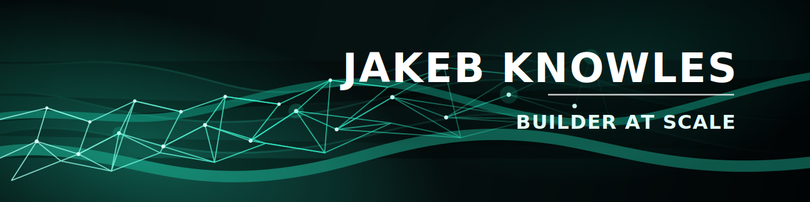

  

<h1 align="center">Jakeb Knowles</h1>

  <strong>Code Wrangler @ Simpro | Product-Focused Software Engineer</strong>

  I build and ship products end-to-end, from vague ideas to production reality.
   
  Modernising awkward systems, solving ambiguous problems, and building things people actually use.

  <a href="https://jakebknowles.com">Website</a>
  ·
  <a href="https://www.linkedin.com/in/jakeb-knowles-software-dev/">LinkedIn</a>

## Builder At Scale

I like the full shape of the work: understanding the problem, choosing the right thing to build, wiring up the backend, shaping the frontend, and seeing it survive production. At Simpro, that usually means the weird, ambiguous, high-leverage problems that do not come with a neat little blueprint.

Outside of work, I build my own products for the same reason I like the day job: I enjoy turning rough ideas into something real. It keeps the standards honest. If the brief is fuzzy and the system is slightly cursed, I am usually interested.

## Snapshot

- Code Wrangler @ Simpro, building across product, frontend, backend, integrations, docs, and release work.
- Moved from Junior Software Developer to Software Engineer in under a year by learning fast and shipping through ambiguity.
- Product-focused by default. I care about building the right thing as much as building it well.
- AI helps me move faster and tighten feedback loops, but the thinking was there long before the tooling caught up.

## Currently Building

### Trendsetter

An AI-powered goal-setting app that turns a conversation into a real plan, timeline, and trackable progress system.

Built with Expo and React Native on top of a Laravel API, OpenAI, SQLite, Zustand, and a test-backed workflow. It is the clearest expression of how I like to build: product-first, full-stack, and fast-moving.

[App Repo](https://github.com/jakeb-k/trendsetter) · [API Repo](https://github.com/jakeb-k/trendsetter-core)

## Flagship Build

### Picklewear

Full-stack e-commerce rebuild born from a forced rebrand, with a better product and a stronger technical foundation on the other side.

Laravel, Inertia, React, MySQL, Stripe, automated Alibaba product sync, and zero-downtime staging deploys through GitHub Actions and Forge. Equal parts storefront, ops tooling, and hard-won product lessons.

[Repo](https://github.com/jakeb-k/picklewear) · [View](https://picklewear.com.au)

## Work That Does Not Live In Public Repos

A lot of the work I am proud of sits behind company walls, so the public version is this: I have built a reputation for taking on the strange projects. The legacy refactors. The tooling rebuilds. The "this does not quite fit anywhere" systems work where architecture choices matter more than brute force.

That has meant modernising brittle platforms, improving developer tooling and documentation, and leading work where the hard part is not writing code, it is making the right call early enough that the whole thing does not drift into nonsense.

## How I Work

- Start with the real problem. Good software dies quickly when it solves the wrong thing beautifully.
- Own the stack. I am comfortable moving from product conversations to APIs, UI, release work, and the occasional production gremlin hunt.
- Modernise carefully. I enjoy taking old, awkward systems and dragging them into the present without torching the business.
- Use AI as leverage, not identity. I build structured workflows and validation loops to move faster, but engineering judgment still does the driving.
- Keep it human. I like sharp systems, but I also like working with people. Software gets better when the room does.

## Toolkit, Not Personality

  

